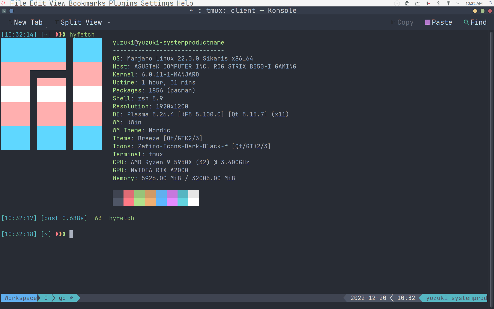

## ZSH (using Oh My ZSH) on Manjaro Linux   
It uses on my zsh passion theme which is a highly saturated color schema supports 256 colors. Uses nord-tmux theme for tmux, come up with autosuggestions and syntax-highlighting.   

<p align="center">
  
</p>

## Prerequirements:   

### Install zsh (If ZSH is not already installed on your Manjaro system you can do it with the command:)   

```
sudo pacman -Syu zsh
```

### Install oh-my-zsh:   

```
cd
sh -c "$(curl -fsSL https://raw.githubusercontent.com/ohmyzsh/ohmyzsh/master/tools/install.sh)"
```

refer to this link:   
https://github.com/ohmyzsh/ohmyzsh   

### Install tmux:   

```
sudo pacman -Syu tmux
```

### Install JetBrainsMono font:   

refer to:   
https://www.jetbrains.com/lp/mono/   

## Install custom theme & plugins and set up ~/.zshrc configuration:   

```
mkdir ~/Package
cd Package
git clone https://github.com/yuzukicat/oh-my-zsh-conf.git
git clone https://github.com/ChesterYue/ohmyzsh-theme-passion.git
git clone https://github.com/zsh-users/zsh-autosuggestions.git
git clone https://github.com/zsh-users/zsh-syntax-highlighting.git
cd ~/
sudo cp -R Package/oh-my-zsh-conf/.zshrc ~/
sudo cp -R Package/ohmyzsh-theme-passion/passion.zsh-theme ~/.oh-my-zsh/custom/themes
sudo cp -R Package/zsh-autosuggestions ~/.oh-my-zsh/custom/plugins
sudo cp -R Package/zsh-syntax-highlighting ~/.oh-my-zsh/custom/plugins
```

refer to this link:   
https://gist.github.com/yovko   

If you already have your .zshrc configuration:   

```
nano ~/.zshrc.pre-oh-my-zsh
```

and add it to ~/.zshrc   

## (Optional) Make zsh default if you haven't already:   

```
chsh -s $(which zsh)
```

## Logout/logon or apply the changes with:   

```
source ~/.zshrc
```

## Set up tmux configuration:   

nano ~/.tmux.conf   

```
set -g default-shell /bin/zsh
run-shell "~/.tmux/nord-tmux/nord.tmux"
```

exit tmux, exit zsh (or console if you use manjaro) and open zsh (or console) to make it take effect.   

```
nano ~/.tmux.conf
mkdir ~/.tmux
sudo cp -R Package/nord-tmux ~/.tmux
tmux source-file ~/.tmux.conf
exit
exit
```

refer to this link:   
https://github.com/arcticicestudio/nord-tmux   

Thanks to adamwuqwq, the macos(apple m1/m2) solution:   
refer to this link:   
https://github.com/adamwuqwq/my_shell_config   
